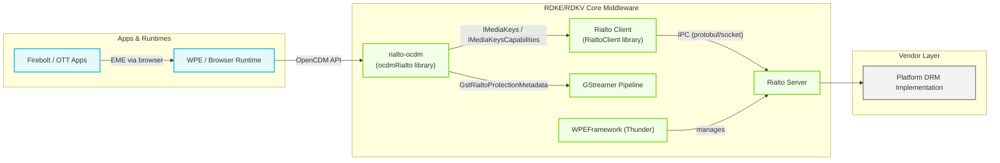
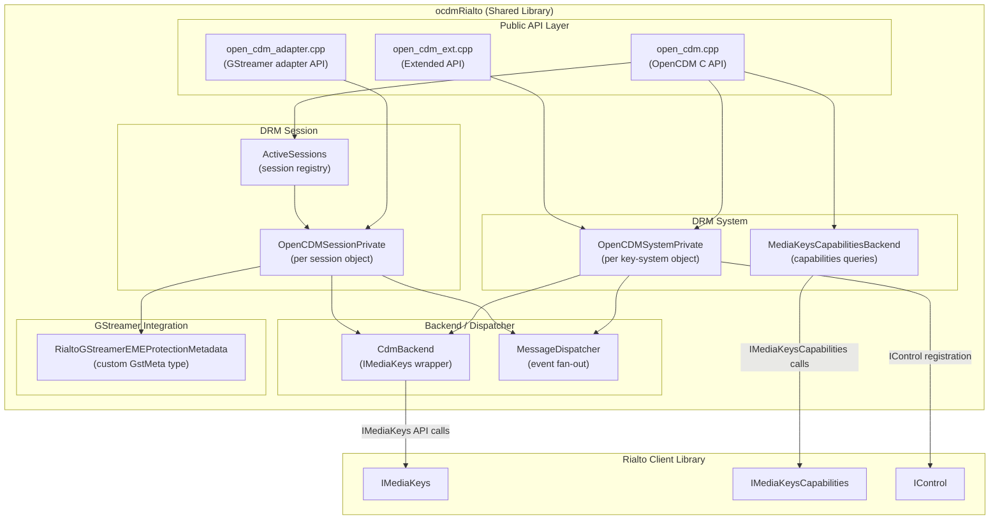
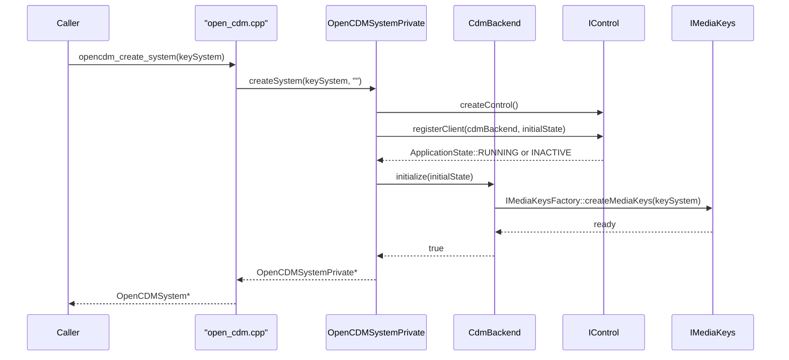
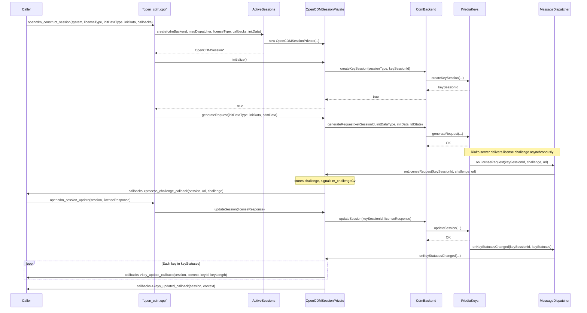
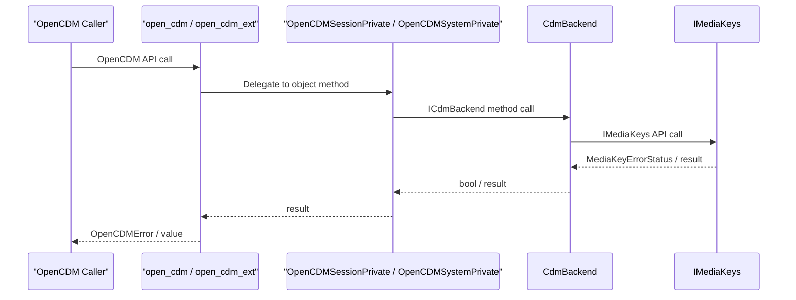
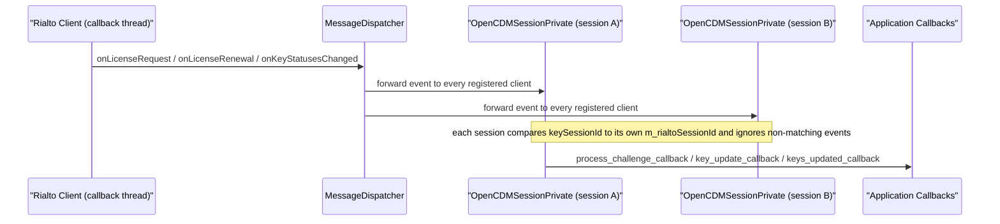

# Rialto-OCDM

---

Rialto-OCDM is a shared library that provides a concrete implementation of the OpenCDM (Open Content Decryption Module) API, routing all DRM operations through the Rialto client stack. It acts as a translation layer: callers—typically a browser or media pipeline—invoke the standard OpenCDM C API, and the library converts those calls into `firebolt::rialto::IMediaKeys` calls directed to the Rialto server process. The Rialto server holds the hardware DRM handles, and the consuming application process interacts with DRM hardware exclusively through that boundary, maintaining a clear security separation between application containers and platform resources.

The library also integrates with GStreamer by registering a custom buffer metadata type (`GstRialtoProtectionMetadata`) and implementing the GStreamer-specific OpenCDM adapter API. This allows a GStreamer-based media pipeline to attach EME (Encrypted Media Extensions) protection information to compressed buffers before they reach the Rialto media pipeline for decryption.

At the device level, the library enables applications that rely on W3C EME—such as OTT streaming clients—to perform DRM-protected playback on a device where the DRM subsystem lives inside a privileged Rialto server process, enforcing a clear security boundary between application containers and platform resources.

At the module level, it manages the full DRM session lifecycle (system creation, session creation, license request generation, license update, key status tracking, and session teardown) and provides capabilities introspection (supported key systems, robustness levels, key-system version).



**Key Features & Responsibilities:**

- **OpenCDM API implementation**: Implements the OpenCDM C API surface (`open_cdm.h`, `open_cdm_adapter.h`, `open_cdm_ext.h`) for session and system lifecycle operations, decryption metadata attachment, and license exchange. A subset of entry points are unsupported against Rialto: `opencdm_session_decrypt()` returns `ERROR_FAIL`; `opencdm_session_error()`, `opencdm_session_resetoutputprotection()`, and `opencdm_session_set_parameter()` are no-ops; and the extended secure-stop API in `open_cdm_ext.h` is unimplemented.
- **DRM session lifecycle management**: Handles the complete sequence of key-session operations—creation, license challenge generation, license update, session load, and session close/remove—via the Rialto `IMediaKeys` interface.
- **Key-system capabilities introspection**: Exposes key-system support checks, key-system version, supported robustness levels, and server-certificate support through `MediaKeysCapabilitiesBackend`, which delegates to `firebolt::rialto::IMediaKeysCapabilities`. `MediaKeysCapabilitiesBackend::getSupportedKeySystems()` is defined on the backend but is not currently called from any public OpenCDM entry point.
- **GStreamer EME buffer metadata**: Registers a custom GStreamer metadata type (`GstRialtoProtectionMetadata`) that carries encryption parameters (sub-sample layout, IV, key ID) on GStreamer buffers, enabling the GStreamer decrypt element downstream to retrieve protection info without additional out-of-band signalling.
- **Application-state-aware initialization**: Monitors the Rialto server application state via `IControl`. The `CdmBackend` defers `IMediaKeys` construction until the Rialto server transitions to the RUNNING state, ensuring no DRM calls are issued against an unavailable server.
- **Multi-session fan-out notification**: A `MessageDispatcher` receives DRM event callbacks (license request, license renewal, key-status change) from the single `IMediaKeysClient` registered with `IMediaKeys` and fans them out to all active `OpenCDMSessionPrivate` listeners.
- **Extended DRM store management**: Exposes key-store and DRM-store hash retrieval, deletion, LDL (Limited Duration License) session limit query, DRM time query, and per-session DRM error reporting through the extended OpenCDM API (`open_cdm_ext.h`).

---

## Design

Rialto-OCDM is designed around a layered delegation model. The public API surface is kept deliberately thin: the C functions in `open_cdm.cpp`, `open_cdm_adapter.cpp`, and `open_cdm_ext.cpp` perform only parameter validation and then delegate entirely to concrete C++ objects. All DRM state is owned by those objects, which are hidden behind abstract interfaces (`ICdmBackend`, `IMessageDispatcher`). This separation allows unit tests to substitute mock backends without modifying any API logic.

The design deliberately avoids exposing any platform-specific DRM handle across the library boundary. All DRM operations are serialised through the Rialto client IPC channel. The library therefore treats `firebolt::rialto::IMediaKeys` as its sole HAL boundary for session lifecycle primitives: session creation, request generation, and license delivery each map one-to-one to an `IMediaKeys` method call. Key selection is handled differently — `opencdm_session_select_key_id()` resolves to `OpenCDMSessionPrivate::selectKeyId()`, which stores the key ID locally for GStreamer protection metadata rather than forwarding it to `CdmBackend::selectKeyId()` / `IMediaKeys::selectKeyId()`.

Northbound interactions (from OpenCDM callers) use the standard C API: calls that only pass request data and return a status code (e.g. `opencdm_session_update`) are synchronous. License challenges and key-status changes, however, are delivered back to the caller asynchronously through `OpenCDMSessionCallbacks`, invoked on the Rialto client callback thread rather than the thread that issued the original request. Southbound interactions (toward Rialto) are managed through the Rialto client library, which internally handles IPC. The `CdmBackend` wraps this boundary with a mutex and a condition variable so that concurrent OpenCDM calls from multiple threads do not race on the shared `IMediaKeys` pointer.

IPC between rialto-ocdm and the Rialto server is fully handled by the Rialto client library layer below this component. From rialto-ocdm's perspective, the communication is opaque: it calls virtual interface methods on `IMediaKeys` and receives asynchronous notifications via `IMediaKeysClient` callbacks. The library relies on the Rialto client library to open and manage the underlying communication channel.

Key-store and DRM-store operations are delegated as pass-through calls to the Rialto server, which retains all persistent DRM state.



#### Threading Model

- **Threading Architecture**: Multi-threaded. Callers may invoke OpenCDM API functions from any thread. Rialto client delivers DRM event callbacks on its own internal thread.
- **Main / Caller Threads**: Any thread that calls an OpenCDM API function. The library operates without a designated main thread; per-object mutexes serialise access to fields such as the `IMediaKeys` pointer and the challenge buffer, though not every shared field is covered (see Synchronization).
- **Worker Threads** (if applicable):
  - _Rialto client callback thread_: Owned by the Rialto client library; delivers `onLicenseRequest`, `onLicenseRenewal`, and `onKeyStatusesChanged` callbacks into `MessageDispatcher`, which fans them out to registered session clients.
- **Synchronization**:
  - `CdmBackend` uses `std::mutex` + `std::condition_variable` to guard the `IMediaKeys` pointer and to block `createKeySession` for up to one second waiting for the RUNNING application state.
  - `MessageDispatcher` uses `std::mutex` to protect its set of registered `IMediaKeysClient` pointers.
  - `ActiveSessions` uses `std::mutex` for reference-counted session creation, lookup, and removal.
  - `OpenCDMSessionPrivate` uses `std::mutex` + `std::condition_variable` (`m_challengeCv`) to synchronise challenge-data retrieval with the asynchronous `onLicenseRequest` callback. The key-status map (`m_keyStatuses`) is updated in `onKeyStatusesChanged` and read in `status()` without holding this mutex, so concurrent access to key status between the Rialto callback thread and a caller thread is not synchronised.
- **Async / Event Dispatch**: DRM events arrive asynchronously on the Rialto callback thread. `MessageDispatcher` holds its mutex for the duration of fan-out, delivering each event synchronously to every registered `IMediaKeysClient`. Session callbacks (`OpenCDMSessionCallbacks`) are then invoked inline on the same callback thread.

### Prerequisites and Dependencies

#### Platform and Integration Requirements

- **Build Dependencies**: The component's own CMake configuration requires the `gstreamer-app-1.0` pkg-config module and `find_package(Rialto 1.0 REQUIRED)`, providing `IMediaKeys`, `IMediaKeysCapabilities`, and `IControl`. The associated Yocto recipe additionally depends on `openssl`, `jsoncpp`, `glib-2.0`, `gstreamer1.0`, `gstreamer1.0-plugins-base`, `wpeframework-clientlibraries`, `protobuf`, and `protobuf-native`.
- **Distro Feature Gate**: The Yocto recipe declares `REQUIRED_DISTRO_FEATURES = "enable_rialto"`. This gate is enforced at the Yocto recipe layer; it is not expressed in the component's own CMake configuration.
- **Optional Build Dependency**: `EthanLog` — when present and `RIALTO_ENABLE_ETHAN_LOG` is set at build time, the logging backend switches from syslog to EthanLog (`USE_ETHANLOG` compile definition).
- **Startup Order**: The Rialto server should be reachable before `opencdm_construct_session` is called; if it is not yet in the RUNNING state, `CdmBackend::createKeySession` waits for up to one second for an application-state notification via `IControl` before failing.

---

### Component State Flow

#### Initialization to Active State

When a caller invokes `opencdm_create_system`, a `MessageDispatcher` and a `CdmBackend` are created and an `OpenCDMSystemPrivate` object is constructed. During construction, `OpenCDMSystemPrivate` obtains an `IControl` handle and calls `registerClient(m_cdmBackend, initialState)`. If the Rialto server is already in the RUNNING state, `CdmBackend::initialize` creates `IMediaKeys` immediately; otherwise, the `notifyApplicationState(RUNNING)` callback triggers deferred creation when the server becomes ready.

The component transitions through the following states: **Constructed** (objects created, IControl obtained) → **Registering** (client registered with IControl, initial application state queried) → **Initializing** (`CdmBackend::initialize` called). From Initializing, the component reaches **Active** (IMediaKeys created, ready for session operations) only if the queried initial state is RUNNING; if the initial state is not RUNNING, `CdmBackend::initialize` sets `m_appState` directly to that state without creating `IMediaKeys`, moving straight to **Inactive**. From either state, subsequent `notifyApplicationState` callbacks drive further transitions between **Active** and **Inactive**, ending in **Destroyed** (system object deleted).

```mermaid
sequenceDiagram
    participant Caller as Caller
    participant OpenCDM as "open_cdm.cpp"
    participant SysPriv as OpenCDMSystemPrivate
    participant CdmB as CdmBackend
    participant MsgD as MessageDispatcher
    participant ICtrl as IControl
    participant IMK as IMediaKeys

    Caller->>OpenCDM: opencdm_create_system(keySystem)
    OpenCDM->>MsgD: new MessageDispatcher
    OpenCDM->>CdmB: new CdmBackend(keySystem, msgDispatcher, factory)
    OpenCDM->>SysPriv: new OpenCDMSystemPrivate(...)
    SysPriv->>ICtrl: IControlFactory::createControl()
    SysPriv->>ICtrl: registerClient(cdmBackend, initialState)
    ICtrl-->>SysPriv: initialState returned
    SysPriv->>CdmB: initialize(initialState)
    alt initialState == RUNNING
        CdmB->>IMK: IMediaKeysFactory::createMediaKeys(keySystem)
        IMK-->>CdmB: IMediaKeys instance
    else initialState != RUNNING
        Note over CdmB: m_appState set directly to initialState; IMediaKeys not created
    end
    CdmB-->>SysPriv: initialized
    SysPriv-->>OpenCDM: OpenCDMSystem object
    OpenCDM-->>Caller: OpenCDMSystem*

    loop Runtime: Rialto state changes
        ICtrl->>CdmB: notifyApplicationState(INACTIVE)
        CdmB->>IMK: reset (release IMediaKeys)
        ICtrl->>CdmB: notifyApplicationState(RUNNING)
        CdmB->>IMK: createMediaKeys(keySystem)
    end

    Caller->>OpenCDM: opencdm_destruct_system(system)
    OpenCDM->>SysPriv: delete
```

#### Runtime State Changes

**State Change Triggers:**

- When the Rialto server transitions to INACTIVE (e.g., server restart), `CdmBackend::notifyApplicationState(INACTIVE)` releases the `IMediaKeys` instance. DRM operation calls return an inactive-state error until the server resumes the RUNNING state.
- When the Rialto server returns to RUNNING, `notifyApplicationState(RUNNING)` re-creates the `IMediaKeys` instance and notifies any thread blocked in `createKeySession` via `m_cv.notify_one()`.

**Context Switching Scenarios:**

- When a caller attempts `opencdm_construct_session` before the Rialto server reaches the RUNNING state, `CdmBackend::createKeySession` waits on the condition variable for up to one second, allowing the server time to complete its transition. `ERROR_FAIL` is returned upon the one-second timeout expiring.

---

### Call Flows

#### Initialization Call Flow



#### Request Processing Call Flow

The DRM session establishment flow begins when the caller constructs a session. The library validates parameters, creates the session object, calls `initialize()` to obtain a Rialto session ID, then calls `generateRequest()`. The Rialto server asynchronously delivers a license challenge via `onLicenseRequest`, which `MessageDispatcher` fans out to the owning `OpenCDMSessionPrivate`. The session stores the challenge and signals the waiting `getChallengeData` caller via a condition variable. The caller then acquires the challenge and delivers the license response back via `opencdm_session_update`.



---

## Internal Modules

> Note: in this repository, `source/...` and `include/...` paths in this document are relative to the `library/` directory (e.g., `library/source/...`, `library/include/...`).

| Module / Class                         | Description                                                                                                                                                                                                                                                                                                                                                | Key Files                                                                                           |
| -------------------------------------- | ---------------------------------------------------------------------------------------------------------------------------------------------------------------------------------------------------------------------------------------------------------------------------------------------------------------------------------------------------------- | --------------------------------------------------------------------------------------------------- |
| `open_cdm`                             | Implements the standard OpenCDM C API. Handles system and session lifecycle calls, capability queries, and session-property accessors. Receives all data from the external caller.                                                                                                                                                                         | `source/open_cdm.cpp`                                                                               |
| `open_cdm_adapter`                     | Implements the GStreamer-specific OpenCDM adapter API. Attaches `GstRialtoProtectionMetadata` to GStreamer buffers in response to decrypt requests.                                                                                                                                                                                                        | `source/open_cdm_adapter.cpp`                                                                       |
| `open_cdm_ext`                         | Implements the extended OpenCDM API: LDL session limit, key-store hash, DRM-store hash, store deletion, DRM header setting, challenge data retrieval, session metric data, and DRM time. The secure-stop entry points (`opencdm_system_ext_*secure_stop*`) are unsupported: each logs a warning and returns `ERROR_FAIL` or `0` without contacting Rialto. | `source/open_cdm_ext.cpp`                                                                           |
| `OpenCDMSystemPrivate`                 | Concrete `OpenCDMSystem` implementation. Owns `CdmBackend` and `MessageDispatcher` per key system. Registers with `IControl` and drives `CdmBackend` initialisation.                                                                                                                                                                                       | `source/OpenCDMSystemPrivate.cpp`, `include/OpenCDMSystemPrivate.h`                                 |
| `OpenCDMSessionPrivate`                | Concrete `OpenCDMSession` and `IMediaKeysClient` implementation. Manages one key session's lifecycle and key-status map. Blocks on a condition variable to synchronise challenge retrieval with the asynchronous license-request callback.                                                                                                                 | `source/OpenCDMSessionPrivate.cpp`, `include/OpenCDMSessionPrivate.h`                               |
| `CdmBackend`                           | Wraps `firebolt::rialto::IMediaKeys` and implements `IControlClient`. Defers `IMediaKeys` creation until the Rialto server is in the RUNNING state. Guards all `IMediaKeys` calls with a mutex.                                                                                                                                                            | `source/CdmBackend.cpp`, `include/CdmBackend.h`                                                     |
| `MediaKeysCapabilitiesBackend`         | Wraps `firebolt::rialto::IMediaKeysCapabilities` and provides key-system support queries, version retrieval, server-certificate support check, and robustness-level enumeration. A single instance is shared across the process lifecycle.                                                                                                                 | `source/MediaKeysCapabilitiesBackend.cpp`, `include/MediaKeysCapabilitiesBackend.h`                 |
| `MessageDispatcher`                    | Implements `IMediaKeysClient` as a shared event dispatcher registered with `CdmBackend`. Maintains a set of registered client pointers and fans out license-request, license-renewal, and key-status-change events to all active sessions.                                                                                                                 | `source/MessageDispatcher.cpp`, `include/MessageDispatcher.h`                                       |
| `ActiveSessions`                       | Process-wide registry of live `OpenCDMSession` objects with reference counting. Supports creation, lookup by key ID, and reference-counted removal.                                                                                                                                                                                                        | `source/ActiveSessions.cpp`, `include/ActiveSessions.h`                                             |
| `RialtoGStreamerEMEProtectionMetadata` | Registers the `GstRialtoProtectionMetadataAPI` GStreamer meta type using `gst_meta_register`. Provides helper to attach a `GstStructure` carrying EME protection info to a `GstBuffer`.                                                                                                                                                                    | `source/RialtoGStreamerEMEProtectionMetadata.cpp`, `include/RialtoGStreamerEMEProtectionMetadata.h` |
| `Logger`                               | Provides per-component tagged logging with severity levels (fatal, error, warn, mil, info, debug). Dispatches to syslog by default, EthanLog when built with `USE_ETHANLOG`, console when `RIALTO_CONSOLE_LOG=1`, or a file when `RIALTO_LOG_PATH` is set.                                                                                                 | `source/Logger.cpp`, `include/Logger.h`                                                             |

---

## Component Interactions

Rialto-OCDM interacts with the Rialto client library on its southbound interface and with the calling application or browser runtime on its northbound interface.

### Interaction Matrix

| Target Component / Layer | Interaction Purpose                                                | Key APIs / Topics                                                                                                                                                                                                                                                                                                                                                                                    |
| ------------------------ | ------------------------------------------------------------------ | ---------------------------------------------------------------------------------------------------------------------------------------------------------------------------------------------------------------------------------------------------------------------------------------------------------------------------------------------------------------------------------------------------- |
| **Rialto Client**        |                                                                    |                                                                                                                                                                                                                                                                                                                                                                                                      |
| `IMediaKeys`             | DRM session lifecycle operations                                   | `createKeySession()`, `generateRequest()`, `loadSession()`, `updateSession()`, `setDrmHeader()`, `closeKeySession()`, `removeKeySession()`, `selectKeyId()`, `containsKey()`, `deleteDrmStore()`, `deleteKeyStore()`, `getDrmStoreHash()`, `getKeyStoreHash()`, `getLdlSessionsLimit()`, `getLastDrmError()`, `getDrmTime()`, `getCdmKeySessionId()`, `releaseKeySession()`, `getMetricSystemData()` |
| `IMediaKeysCapabilities` | Key-system capability queries                                      | `supportsKeySystem()`, `getSupportedKeySystemVersion()`, `isServerCertificateSupported()`, `getSupportedRobustnessLevels()` (`getSupportedKeySystems()` is defined on the backend but has no public OpenCDM caller)                                                                                                                                                                                  |
| `IControl`               | Application-state monitoring and lifecycle                         | `registerClient()`, `notifyApplicationState()` callback                                                                                                                                                                                                                                                                                                                                              |
| `IMediaKeysClient`       | Asynchronous DRM event reception                                   | `onLicenseRequest()`, `onLicenseRenewal()`, `onKeyStatusesChanged()`                                                                                                                                                                                                                                                                                                                                 |
| **GStreamer**            |                                                                    |                                                                                                                                                                                                                                                                                                                                                                                                      |
| GStreamer meta API       | Attaches EME protection parameters to compressed GStreamer buffers | `gst_meta_register()`, `gst_meta_api_type_register()`, `rialto_mse_add_protection_metadata()`                                                                                                                                                                                                                                                                                                        |
| **Caller / Application** |                                                                    |                                                                                                                                                                                                                                                                                                                                                                                                      |
| OpenCDM consumer         | Initiates all DRM operations via standard OpenCDM C API            | `opencdm_create_system()`, `opencdm_construct_session()`, `opencdm_session_update()`, `opencdm_gstreamer_session_decrypt_ex()` and related functions                                                                                                                                                                                                                                                 |

### Events Published

| Event Name                   | Topic                                                 | Trigger Condition                                                                                                                                                       | Subscriber Components          |
| ---------------------------- | ----------------------------------------------------- | ----------------------------------------------------------------------------------------------------------------------------------------------------------------------- | ------------------------------ |
| `process_challenge_callback` | `OpenCDMSessionCallbacks::process_challenge_callback` | Rialto server delivers a license challenge via `onLicenseRequest`, or a license renewal via `onLicenseRenewal` (delivered through the same callback, with an empty URL) | OpenCDM caller (browser / app) |
| `key_update_callback`        | `OpenCDMSessionCallbacks::key_update_callback`        | Invoked once per key entry when `onKeyStatusesChanged` reports a key-status change                                                                                      | OpenCDM caller (browser / app) |
| `keys_updated_callback`      | `OpenCDMSessionCallbacks::keys_updated_callback`      | Invoked once after all key entries in an `onKeyStatusesChanged` batch have been processed                                                                               | OpenCDM caller (browser / app) |

### IPC Flow Patterns

**Primary Request / Response Flow:**

All DRM operation calls are dispatched synchronously through `CdmBackend` to `IMediaKeys`. The Rialto client library handles the underlying IPC channel; rialto-ocdm sees only a synchronous return value indicating `MediaKeyErrorStatus::OK` or a failure code.



**Event Notification Flow:**

DRM events originate on the Rialto client callback thread, enter `MessageDispatcher`, and are distributed synchronously to all registered session listeners. Session callbacks into the application are invoked inline on the same callback thread.



---

## Implementation Details

### Major HAL APIs Integration

All DRM HAL interactions are routed through the Rialto client library interfaces (`IMediaKeys`, `IMediaKeysCapabilities`, `IControl`), which abstract the underlying platform DRM implementation.

| Rialto Client API                                        | Purpose                                                                                                                                                   | Implementation File                       |
| -------------------------------------------------------- | --------------------------------------------------------------------------------------------------------------------------------------------------------- | ----------------------------------------- |
| `IMediaKeys::createKeySession()`                         | Creates a new DRM key session on the Rialto server                                                                                                        | `source/CdmBackend.cpp`                   |
| `IMediaKeys::generateRequest()`                          | Triggers license challenge generation for a session                                                                                                       | `source/CdmBackend.cpp`                   |
| `IMediaKeys::loadSession()`                              | Loads a previously persisted DRM session                                                                                                                  | `source/CdmBackend.cpp`                   |
| `IMediaKeys::updateSession()`                            | Delivers a license response to an active session                                                                                                          | `source/CdmBackend.cpp`                   |
| `IMediaKeys::setDrmHeader()`                             | Sets a DRM-specific header on a session                                                                                                                   | `source/CdmBackend.cpp`                   |
| `IMediaKeys::closeKeySession()`                          | Closes an active key session                                                                                                                              | `source/CdmBackend.cpp`                   |
| `IMediaKeys::removeKeySession()`                         | Removes a key session and releases its licenses                                                                                                           | `source/CdmBackend.cpp`                   |
| `IMediaKeys::selectKeyId()`                              | Selects the active key ID for decryption; not currently invoked from the public OpenCDM session API, which stores the key ID locally instead (see Design) | `source/CdmBackend.cpp`                   |
| `IMediaKeys::containsKey()`                              | Tests whether a key ID is present in the session                                                                                                          | `source/CdmBackend.cpp`                   |
| `IMediaKeys::deleteDrmStore()`                           | Deletes the DRM store on the server                                                                                                                       | `source/CdmBackend.cpp`                   |
| `IMediaKeys::deleteKeyStore()`                           | Deletes the key store on the server                                                                                                                       | `source/CdmBackend.cpp`                   |
| `IMediaKeys::getDrmStoreHash()`                          | Retrieves a hash of the DRM store                                                                                                                         | `source/CdmBackend.cpp`                   |
| `IMediaKeys::getKeyStoreHash()`                          | Retrieves a hash of the key store                                                                                                                         | `source/CdmBackend.cpp`                   |
| `IMediaKeys::getLdlSessionsLimit()`                      | Queries the maximum number of LDL sessions                                                                                                                | `source/CdmBackend.cpp`                   |
| `IMediaKeys::getLastDrmError()`                          | Retrieves the most recent DRM error code for a session                                                                                                    | `source/CdmBackend.cpp`                   |
| `IMediaKeys::getDrmTime()`                               | Retrieves the DRM clock time                                                                                                                              | `source/CdmBackend.cpp`                   |
| `IMediaKeys::getCdmKeySessionId()`                       | Retrieves the CDM-level session ID string                                                                                                                 | `source/CdmBackend.cpp`                   |
| `IMediaKeys::releaseKeySession()`                        | Releases a session after use                                                                                                                              | `source/CdmBackend.cpp`                   |
| `IMediaKeys::getMetricSystemData()`                      | Retrieves DRM metric/diagnostic data                                                                                                                      | `source/CdmBackend.cpp`                   |
| `IMediaKeysCapabilities::supportsKeySystem()`            | Checks whether a key system is available                                                                                                                  | `source/MediaKeysCapabilitiesBackend.cpp` |
| `IMediaKeysCapabilities::getSupportedKeySystems()`       | Enumerates all available key systems; defined on the backend but not currently called from any public OpenCDM entry point                                 | `source/MediaKeysCapabilitiesBackend.cpp` |
| `IMediaKeysCapabilities::getSupportedKeySystemVersion()` | Returns the version string of a key system                                                                                                                | `source/MediaKeysCapabilitiesBackend.cpp` |
| `IMediaKeysCapabilities::isServerCertificateSupported()` | Reports whether a key system accepts server certificates                                                                                                  | `source/MediaKeysCapabilitiesBackend.cpp` |
| `IMediaKeysCapabilities::getSupportedRobustnessLevels()` | Enumerates supported robustness levels for a key system                                                                                                   | `source/MediaKeysCapabilitiesBackend.cpp` |
| `IControl::registerClient()`                             | Registers `CdmBackend` to receive application-state notifications                                                                                         | `source/OpenCDMSystemPrivate.cpp`         |

### Key Implementation Logic

- **State / Lifecycle Management**: `CdmBackend` tracks the Rialto server application state (`m_appState`) and gates all `IMediaKeys` method calls on whether `m_mediaKeys` is non-null. `CdmBackend::initialize()` sets the initial state directly: UNKNOWN → RUNNING (create `IMediaKeys`) if the queried initial state is RUNNING, or UNKNOWN → INACTIVE (no `IMediaKeys` created) otherwise. After initialization, `notifyApplicationState` callbacks drive further RUNNING ↔ INACTIVE transitions, creating `IMediaKeys` on entry to RUNNING and releasing it on entry to INACTIVE.
  - Core implementation: `source/CdmBackend.cpp`
  - Session lifecycle: `source/OpenCDMSessionPrivate.cpp`

- **Event Processing**: DRM events from the Rialto server arrive on the Rialto client callback thread into `MessageDispatcher`. The dispatcher holds its mutex and iterates over the registered client set, calling each `IMediaKeysClient` listener synchronously. `OpenCDMSessionPrivate` receives the event, updates internal state (challenge buffer, key-status map), signals the condition variable (`m_challengeCv`) if a challenge was received, and then invokes the caller-supplied `OpenCDMSessionCallbacks` inline.
  - Dispatch: `source/MessageDispatcher.cpp`
  - Event handling: `source/OpenCDMSessionPrivate.cpp`

- **Error Handling Strategy**: Each `CdmBackend` method checks whether `m_mediaKeys` is non-null before forwarding the call, returning `false` on an inactive state, which maps to `ERROR_FAIL` at the API layer. `MediaKeyErrorStatus::OK` is the single success comparison; any other value is treated as failure. `opencdm_session_system_error()` retrieves the DRM error code internally via `getLastDrmError()` but does not surface it to the caller — it returns `ERROR_NONE` for any non-null session regardless of the retrieved value. Error recovery is the responsibility of the caller.
  - Error propagation: `source/CdmBackend.cpp`, `source/open_cdm.cpp`

- **Logging & Diagnostics**: `CdmBackend`, `OpenCDMSessionPrivate`, and `OpenCDMSystemPrivate` each own a `Logger` instance named after the component; `open_cdm.cpp`, `open_cdm_adapter.cpp`, and `open_cdm_ext.cpp` each instantiate a free-standing named `Logger` for their C API functions. `MessageDispatcher`, `ActiveSessions`, and `MediaKeysCapabilitiesBackend` do not use `Logger`. Log lines carry a `[ComponentName][severity]` prefix. The log verbosity is controlled at runtime by the `RIALTO_DEBUG` environment variable (0 = fatal only, 5 = all debug messages; default is warn). Log output is directed to syslog by default, to EthanLog when built with `USE_ETHANLOG`, to standard output when `RIALTO_CONSOLE_LOG=1`, or to a file when `RIALTO_LOG_PATH` is set (the file receives a `.ocdm` suffix to distinguish it from the Rialto server log).
  - Implementation: `source/Logger.cpp`, `include/Logger.h`

---

## Configuration

### Key Configuration Parameters

| Parameter                 | Type              | Default    | Description                                                                                                     |
| ------------------------- | ----------------- | ---------- | --------------------------------------------------------------------------------------------------------------- |
| `RIALTO_DEBUG`            | int (env var)     | `2` (warn) | Controls log verbosity. Values: 0 = fatal, 1 = error, 2 = warn, 3 = milestone, 4 = info, 5 = debug.             |
| `RIALTO_CONSOLE_LOG`      | bool (env var)    | `0`        | When set to `1`, redirects log output to standard output instead of syslog.                                     |
| `RIALTO_LOG_PATH`         | string (env var)  | `""`       | When set, writes log output to the specified file path with `.ocdm` appended as a suffix.                       |
| `RIALTO_ENABLE_ETHAN_LOG` | bool (cmake flag) | `OFF`      | Build-time flag; when set alongside the EthanLog package, switches the logging backend from syslog to EthanLog. |

### Runtime Configuration

Log verbosity can be changed at process start by setting the environment variable before launching the consuming process:

```bash
# Enable debug logging
RIALTO_DEBUG=5 <application>

# Redirect logs to a file
RIALTO_LOG_PATH=/var/log/rialto <application>
# Produces /var/log/rialto.ocdm
```

### Configuration Persistence

All DRM store and key store state is retained by the Rialto server process. Environment variable settings take effect at process launch and apply for the lifetime of the consuming process.
